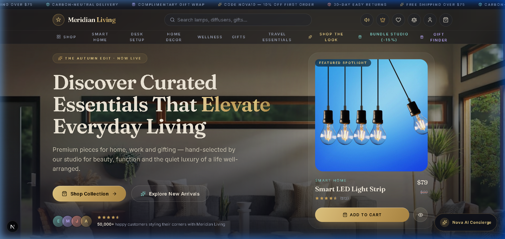
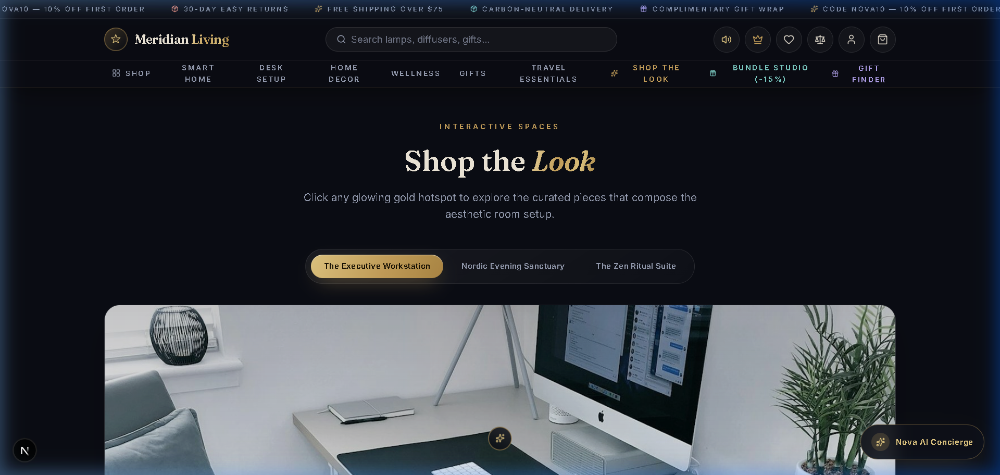
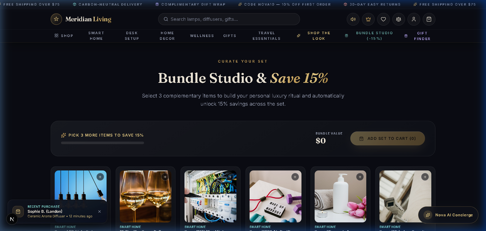
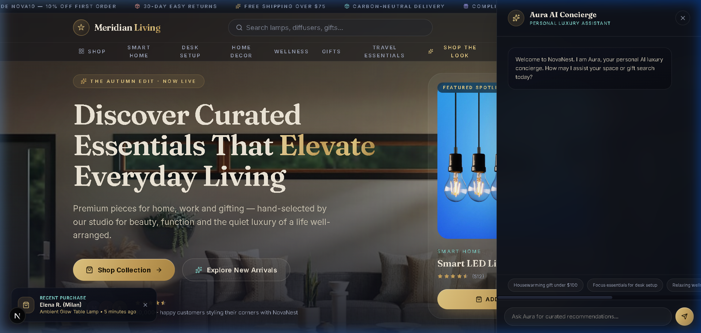
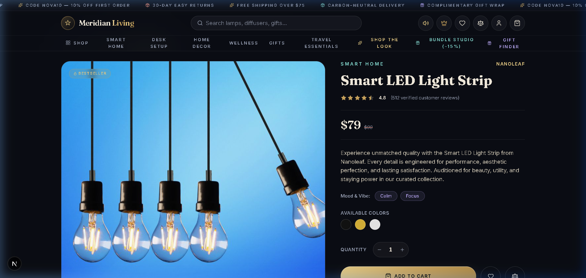
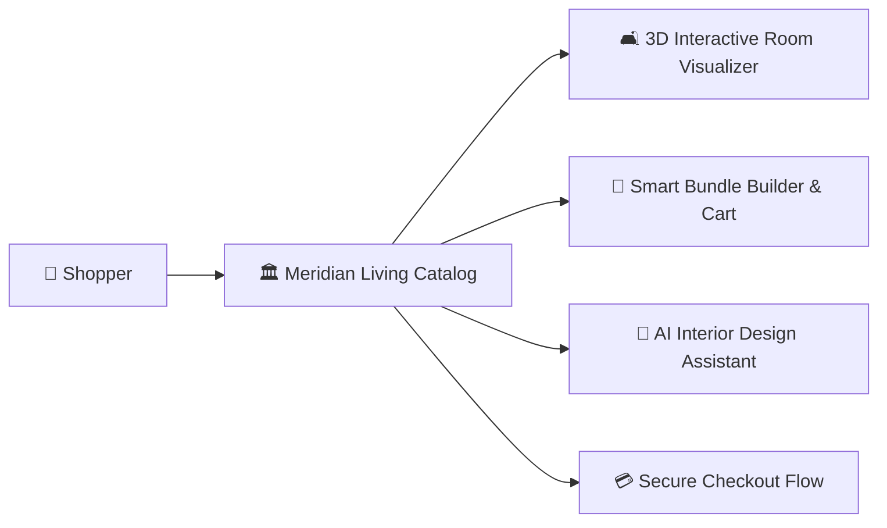

# 🏛️ Meridian Living — Luxury E-Commerce Platform

> **Curated Essentials That Elevate Everyday Living**  
> An ultra-luxurious, modern e-commerce web application featuring a sleek dark aesthetic, deep gold accents, glassmorphic UI elements, smooth micro-animations, and interactive shopping experiences.

---

## 📸 Storefront UI Screenshots & Previews

| Homepage Landing Hero | Shop The Look Interactive Canvas |
| :---: | :---: |
|  |  |

| Bundle & Save Studio | Nova AI Personal Shopper |
| :---: | :---: |
|  |  |

| Product Detail Page |
| :---: |
|  |

---

## 🌟 Highlights & Features

### 🛍️ Curated 90-Piece Product Catalog
- **6 Core Lifestyle Categories**: Smart Home, Desk Setup, Home Decor, Wellness, Gifts, and Travel Essentials (15 hand-selected items per category).
- **Rich Product Metadata**: Customer ratings, review counts, stock counters, mood tags (*Calm*, *Focus*, *Casual*, *Luxury*, *Giftable*), and detailed spec sheets.
- **Dynamic Filters & Search**: Search by query, mood, maximum budget range slider, minimum star rating, and multi-option sorting (Popularity, Price, Rating, Newest).

### ✨ Premium Interactive Features
* **🎨 Shop The Look Canvas**: Interactive interior scenes featuring clickable hotspot stars that open instant product modals (e.g., Herman Miller Ergonomic Task Chair, Ambient Desk Lamps).
* **🤖 Nova AI Personal Concierge**: Built-in luxury AI shopping assistant providing tailored recommendations based on mood, budget, and gift criteria.
* **📦 Bundle & Save Studio**: Mix-and-match bundle creator offering tiered savings (up to 20% off) with real-time cart integration.
* **👑 The Meridian Circle VIP Club**: Exclusive membership modal displaying points balance, status tiers, and VIP perk unlocks.
* **🎁 3-Step Interactive Gift Finder**: Quick quiz matching recipient personality, aesthetic mood, and budget with top curated gift ideas.
* **⚖️ Side-by-Side Product Comparison**: Sticky compare drawer and side-by-side spec comparison modal for up to 3 products.
* **🎵 Web-Audio Sound FX**: Built-in sound synthesizer adding subtle tactile audio feedback on interactions (toggleable via navbar).
* **📸 UGC Community Photo Gallery**: Responsive Instagram showcase tagged `#MeridianLivingInTheWild`.
* **🔔 Live Purchase Activity Ticker**: Real-time ticker notifying buyers of active purchases happening globally.

---

## 🎨 Design System & Aesthetics

- **Color Palette**:
  - **Midnight Background**: `#0a090e` / `#121118`
  - **Deep Gold Accents**: `#d4af37` / `#e4c983`
  - **Ivory Typography**: `#f7f4ee`
  - **Accent Tones**: Lilac (`#b8a4c9`), Teal (`#468a86`), Coral (`#e06d53`)
- **Typography**: Google Fonts `Fraunces` (serif titles) and `Inter` (clean UI body).
- **Glassmorphism & Motion**: Translucent backdrop blurs, subtle floating glow animations, and CSS micro-interactions.

---

## 🏛️ System Architecture



## 🛠️ Technology Stack

- **Framework**: [Next.js 15](https://nextjs.org/) (App Router)
- **UI & Logic**: [React 19](https://react.dev/), [TypeScript](https://www.typescriptlang.org/)
- **Styling**: [Tailwind CSS v4](https://tailwindcss.com/)
- **Icons**: [Lucide React](https://lucide.dev/)
- **Audio Engine**: Web Audio API (Synthesizer)
- **Database / ORM**: Drizzle ORM + Postgres (with in-memory catalog fallback for demo safety)

---

## 📂 Project Structure

```text
E-commerce/
├── public/
│   ├── images/
│   │   ├── products/        # 90 verified high-resolution Pexels/Unsplash assets
│   │   └── stock/           # Editorial & brand photography
├── src/
│   ├── app/
│   │   ├── api/             # API routes (products, newsletter)
│   │   ├── checkout/        # Checkout page component
│   │   ├── product/[slug]/  # Dynamic product detail page
│   │   ├── layout.tsx       # Root layout & font configuration
│   │   └── page.tsx         # Storefront landing page
│   ├── components/
│   │   ├── ai-concierge.tsx # Nova AI shopper assistant
│   │   ├── app-provider.tsx # Global state context & audio engine
│   │   ├── bundle-studio.tsx# Bundle & save interactive tool
│   │   ├── cart-drawer.tsx  # Slide-over cart & gift options
│   │   ├── categories.tsx   # Category grid with mood pills
│   │   ├── collection.tsx   # Product grid, filter sidebar, sorting
│   │   ├── corner.tsx       # Build Your Corner lifestyle block
│   │   ├── footer.tsx       # Newsletter & complete footer navigation
│   │   ├── hero.tsx         # Hero banner with dynamic callouts
│   │   ├── navbar.tsx       # Glassmorphic header & search box
│   │   ├── overlays.tsx     # QuickView, Account, Compare & Gift Finder
│   │   ├── recent-activity.tsx# Purchase activity ticker
│   │   ├── shop-the-look.tsx# Interactive hotspot canvas
│   │   ├── stories.tsx      # Brand story & testimonials
│   │   ├── trending.tsx     # Trending bestsellers & limited drop timer
│   │   ├── ugc-gallery.tsx  # Instagram UGC photo grid
│   │   ├── ui.tsx           # Reusable UI primitives (Stars, Badges, Cards)
│   │   └── vip-loyalty.tsx  # Meridian Circle VIP modal
│   └── lib/
│       ├── catalog-data.ts  # Master catalog (90 luxury products)
│       └── shop.ts          # Shared types, discount logic, filters
├── README.md
├── package.json
└── tsconfig.json
```

---

## 🚀 Getting Started

### Prerequisites
Make sure you have **Node.js 18+** installed on your system.

### 1. Clone the Repository
```bash
git clone https://github.com/SriniwasAwasthi/meridian-living-ecommerce.git
cd meridian-living-ecommerce
```

### 2. Install Dependencies
```bash
npm install
```

### 3. Run Development Server
```bash
npm run dev
```

---

## 💻 NPM Scripts

| Command | Description |
| :--- | :--- |
| `npm run dev` | Launches Next.js local development server |
| `npm run build` | Compiles production bundle |
| `npm run start` | Starts production server |
| `npm run typecheck` | Executes TypeScript type safety checks (`tsc --noEmit`) |
| `npm run lint` | Runs Next.js ESLint checks |

---

## 📄 License
© 2026 **Meridian Living Co.** All rights reserved.

---

## 💖 Thank You for Visiting & Exploring 🏛️ Meridian Living — Luxury E-Commerce Platform!

> *\"Thank you for taking the time to explore this project! Continuous learning, clean craftsmanship, and solving real-world challenges through elegant software are at the core of my developer journey.\"* 🚀

* 🌟 **Enjoyed this project?** If you found this repository interesting or helpful, please consider giving it a **Star**!
* 📬 **Let's Connect & Collaborate:** I am actively seeking engineering opportunities, impactful internships, and open-source collaborations. Feel free to connect via [GitHub](https://github.com/SriniwasAwasthi) or [Email](mailto:sriawasthi164@gmail.com)
  * 🌐 **LinkedIn:** [https://www.linkedin.com/in/sriniwas-awasthi/](https://www.linkedin.com/in/sriniwas-awasthi/).

---
<div align="center">
  <sub>Designed & Crafted with Passion by <a href="https://github.com/SriniwasAwasthi"><strong>Sriniwas Awasthi</strong></a> • Continuous Learner & Software Engineer</sub>
</div>
